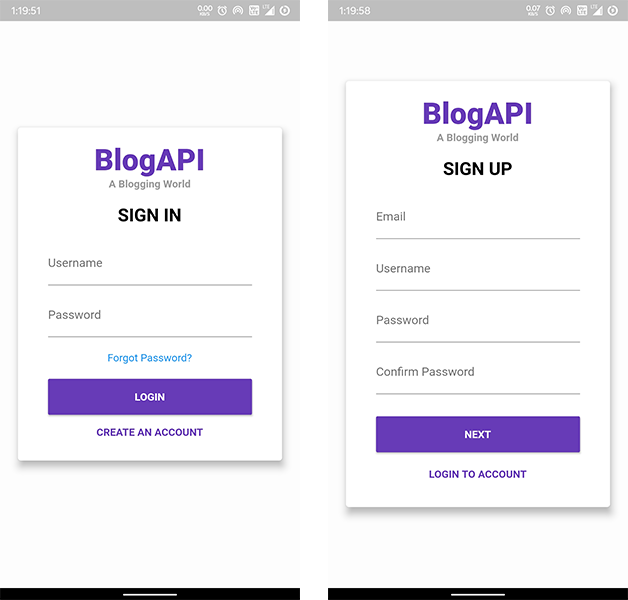

# BlogAPI App

A new blog app for android and ios based on flutter.

## Screenshots

## Connect With Me:

[][website]
[][facebook]
[][twitter]
[][linkedin]
[][instagram]

[github]: https://github.com/nixrajput
[webdevplaylist]: https://github.com/nixrajput
[website]: https://nixlab-blog-api.herokuapp.com
[facebook]: https://facebook.com/nixrajput07
[twitter]: https://facebook.com/nixrajput07
[instagram]: https://instagram.com/nixrajput
[linkedin]: https://linkedin.com/in/nixrajput